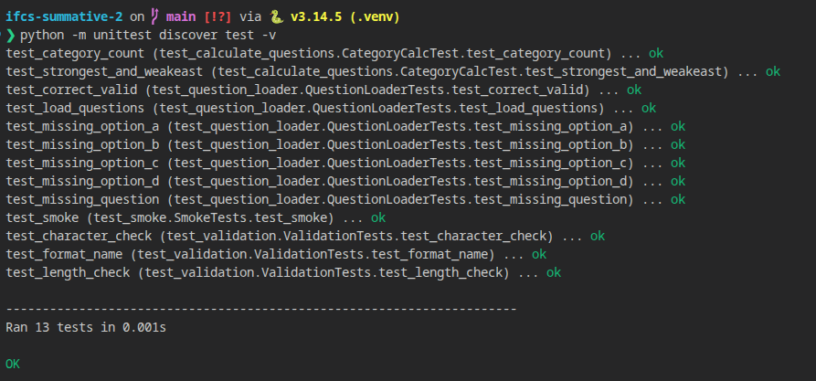
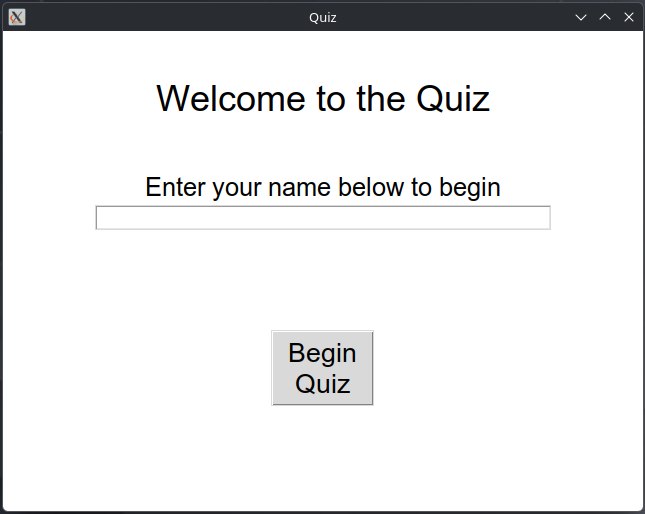
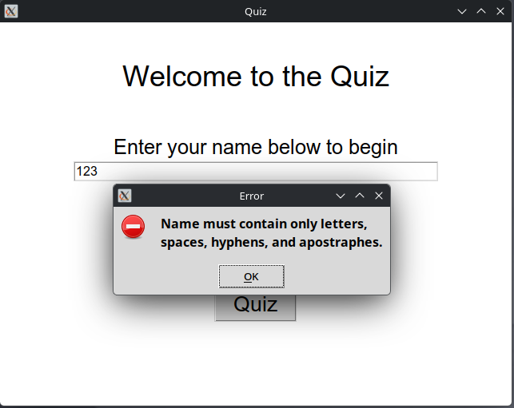
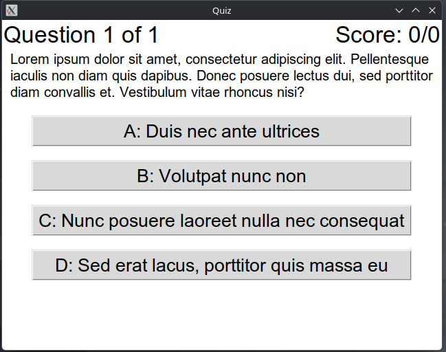
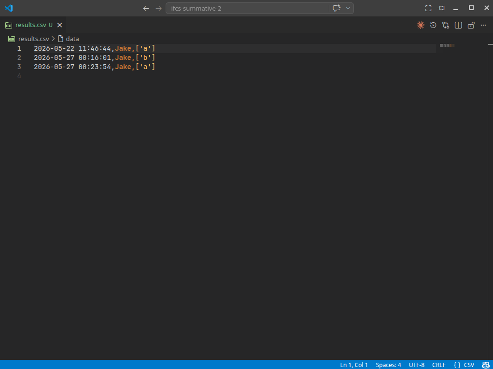
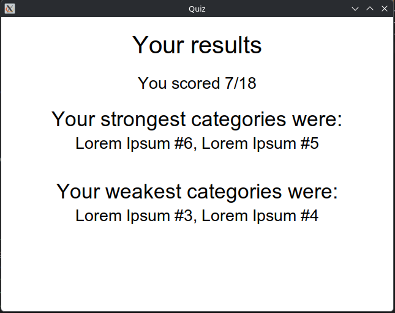

# Quiz
## Introduction
The Quiz app is a Minimum Viable Product (MVP) developed for our workplace, a company providing managed IT services. 

As part of our onboarding, the organisation requires a method of testing new support agents' knowledge to identify gaps in existing skills to focus training in the appropriate areas. It implements a category system so that upon completion, it is possible to see the strongest and weakest areas to enable the focused training

This quiz is developed as a desktop program, utilising [Python](https://python.org) and [Tkinter](https://docs.python.org/3/library/tkinter.html). It collects a participants name and the answers to a set of configurable multiple choice questions spread over various categories.

Before the participant is allowed to take the quiz, the name is validated against a set of rules. If any of these rules fail, the name is refused and the participant must re-enter a valid name before continuing. This ensures that stored records are suitable for later review.
After the name is entered, a set of multiple choice questions (which are provided in a CSV file) are asked to the participant, and their answers are recorded. Immediate feedback is provided as to whether the answer selected was correct or not, and if the answer was not correct, the correct answer is displayed to the participant.

At the end of the quiz, a summary is shown to the user and their score is saved into a CSV file. This storage format allows the results table to be opened by standard spreadsheet software (e.g. Microsoft Excel and Google Sheets) and to be analysed using traditional graphing tooling for users unfamiliar with the specifics of this quiz app.

This MVP focuses on essential functionality (displaying questions and providing answer feedback, a score, and per-category breakdown). Features such as a results viewer, question editor, and authentication are out of scope for this MVP. Due to the modular nature of this app, it is designed to be relatively easy to add these features in the future.

## Design
### GUI Designs
**Figure 1** shows the early prototype which was used during the initial design stage of the program. It represents the basic user journey from the starting screen, to a single question (as an example) to the finish screen highlighting the weak areas.

It contains some basic colour highlighting to showcase the idea clearly, however this is not intended to perfectly represent the end application.


**Figure 1**

**Figure 2** shows the journey related to planned validation requirements and error messages on the name input fields. These ensure that the user enters a valid name before proceeding to the questions


**Figure 2**
### Requirements
#### Functional requirements
| ID  | Requirement                                                                                                                  |
| --- | ---------------------------------------------------------------------------------------------------------------------------- |
| FR1 | The application must allow a user to enter their name                                                                        |
| FR2 | The name entered must be a valid name (e.g. no numbers)                                                                      |
| FR3 | The application must show a single question at a time and all possible answers                                               |
| FR4 | The application must load all questions from a persistent file and not contain any hard coded questions outside of tests     |
| FR5 | The application must save all attempts into some form of persistent storage (e.g. CSV file)                                  |
| FR6 | The application should keep track of the score per question and output a summary based on the question categories at the end |

#### Non-funcational requirements
| ID   | Requirement                                                                                               |
| ---- | --------------------------------------------------------------------------------------------------------- |
| NFR1 | The application should run as a standalone desktop application                                            |
| NFR2 | The application should run on any device that supports Python                                             |
| NFR3 | Stored data should be readable using standalone software                                                  |
| NFR4 | Text and background colours must have a 4.5:1 contrast ratio for all text to ensure readability for users |
| NFR5 | Error messages displayed must be non-technical and easy to understand for all users                       |
### Tech Stack Outline
The following software and libraries are used in the creation and operation of this program
- [Python 3](https://python.org) is the programming language used
- [Tkinter](https://docs.python.org/3/library/tkinter.html) is the GUI library used
- [unittest](https://docs.python.org/3/library/unittest.html) for automated unit testing
- [typing](https://docs.python.org/3/library/typing.html) for type hinting
- [re](https://docs.python.org/3/library/re.html) for regular expression parsing
- [datetime](https://docs.python.org/3/library/datetime.html) for date and time handling

### Code Design
Due to the nature of Tkinter as a framework, this project is heavily object-oriented. **Figure 3** shows the class diagram of the codebase. The [raw DrawIO file](docs/Class%20Diagram.drawio) is also available in the `docs/` folder.


**Figure 3**
## Development
### The different "states"
There is a central (or "root") class `QuizApp` which defines the main window and holds most of the state. This class inherits `tk.Tk`.

Each individual view is its own class inheriting the `tk.Frame` class. This aids in splitting up the project into different classes for different functions so it becomes a lot clearer which view is responsible for which UI elements and the flow between them, and allows for the root class to only contain the necessary state and a few functions for shifting the view:
```py
def draw_welcome_screen(self) -> None:
    """Clears the current view and displays the welcome screen"""
    self.clear_screen()
    self.active_container = screens.WelcomeScreen(self)
    self.active_container.pack(expand=True, fill="both")

def draw_question(self, question_number: int):
    """Clears the current view and displays the provided question number"""
    self.clear_screen()
    self.active_container = screens.QuestionView(self, question_number)
    self.active_container.pack(expand=True, fill="both")

def draw_end_screen(self):
    """Clears the current view and displays the ending screen, showing the results"""
    self.clear_screen()
    self.save_results()
    self.active_container = screens.EndView(self)
    self.active_container.pack(expand=True, fill="both")
```

### Question loading
Questions are loaded from a CSV file and validated to ensure they contain all of the required data (i.e. must have a question, all the options, and which one is correct). A `ValueError` is raised if any of these rules are violated, and the program will exit immediately.

From a flat dictionary the questions are formatted into our internal state to make it easier to manage:
```py
questions.append({
    "question": row["question"],
    "options": {
        "a": row["option_a"].strip(),
        "b": row["option_b"].strip(),
        "c": row["option_c"].strip(),
        "d": row["option_d"].strip()
    },
    "correct": row["correct"],
    "category": row.get("category", None)
})
```

### Validation
When a user enters their name at the start of the quiz, it must be validated to ensure it is a reasonable name. These rules are:
* Must be between 2-50 characters. To achieve this, the length is checked: `return 2 <= len(name) <= 50`
* Must contain only letters, spaces, hyphens and apostrophes. To achieve this, a Regular Expression (Regex) is used to validate the provided name against a set of rules.
  * The Regex in question is `^[a-zA-Z\-' ]+$`, which will check that the entire string matches the pattern.
    * `^` and `$` mean that the string must match the entire pattern.
    * `a-z` matches all lowercase letters
    * `A-Z` matches all uppercase letters
    * `\-' ` matches `-`, `'` and a space literally
    * `+` means match one or more characters

If any of these rules fail, the name is refused and an error message is displayed to the user.

If the user has not entered a name at all:
```py
if not entered_name:
    messagebox.showerror(
        title="Error",
        message="You must enter a name."
    )
```
If the name entered is too short:
```py
elif not validate_name_length(entered_name):
    messagebox.showerror(
        title="Error",
        message="Name must be between 3 and 50 characters."
    )
```
If the name contains invalid characters:
```py
elif not validate_name_characters(entered_name):
    messagebox.showerror(
        title="Error",
        message="Name must contain only letters, spaces, hyphens, and apostrophes."
    )
```

### Asking the questions
The `QuestionView` displays a singular question and all possible answers. Questions can be of varying length, however Tkinter provides a `wraplength` parameter on labels, which will instruct it to automatically wrap the text over multiple lines if it is too long to display.

This parameter takes a fixed value, so on initialisation it is set to `winfo_width` (the width of the frame, which is pinned to the width of the window). However, when the window is resized, by default the wrap size is not adjusted with the window and it will not re-wrap. In order to make it dynamic, we can attach a listener to the `<Configure>` in-built Tkinter event, which fires whenever the window is resized (as the frame does resize automatically).
```py
self.bind('<Configure>', lambda _: question_text_label.configure(wraplength=self.winfo_width()))
```
This will then automatically adjust the text wrapping for the label so that it will adjust as the window resizes. **Figure 4** shows this in action:


**Figure 4**

### Saving the results
At the completion of the final question the results are saved to a CSV file called `results.csv`. It stores the players name, the time they completed the quiz, and the scores for each question. The results file does not currently store the per-category breakdown, this needs to be recalculated based on the question data. 

These files are CSV files so can be viewed by standard spreadsheet software.

### Calculating the categories
On the end screen, the strongest and weakest categories are shown.

The initial plan was to show strongest 3 and weakest 3 categories on the end screen, however it was quickly realised that this would need to be dynamic based on the total number of categories asked.

- If there are under 2 categories, no summary is returned
- If there are 2 or 3 categories, only the strongest and weakest is shown
- If there are between 4 and 7 categories, the strongest and weakest 2 are shown
- If there are 8 or more, the strongest and weakest 3 are shown.

From there, the mapping of category to score is flattened into just a sorted list of categories based on score, and the correct number of elements are returned from each end.

## Testing
Both automated and manual testing was used and performed throughout the development process.

Automated tests in the form of unit testing was added early on and run upon each commit, to ensure code functions across different platforms and to ensure future changes do not break existing functionality.
The `Actions` tab contains the results of every run, and **Figure 5** shows the output of the unit testing:



**Figure 5**

Manual testing was performed throughout the process to test UI interactions and flow as these are harder to test on a headless CI. This was testing that the required UI elements were visible and that the state changes via the buttons worked as intended.

A summary table of manual tests against the functional requirements are below:

| Requirement | Passed | Evidence                                                                 |
| :---------: | :----: | ------------------------------------------------------------------------ |
|     FR1     |  Yes   |                                                      |
|     FR2     |  Yes   |                                                      |
|     FR3     |  Yes   |                                                      |
|     FR4     |  Yes   | [question loader](question_loader.py) and [question file](questions.csv) |
|     FR5     |  Yes   |                                                      |
|     FR6     |  Yes   |                                                      |

A summary table for non-functional requirements
|  ID   | Passed | Evidence                                                                                                                                                                                             |
| :---: | :----: | ---------------------------------------------------------------------------------------------------------------------------------------------------------------------------------------------------- |
| NFR1  |  Yes   | Runs as a Tkinter program                                                                                                                                                                            |
| NFR2  |  Yes   | Does not use any libraries outside of the standard Python library set which is supported on all devices                                                                                              |
| NFR3  |  Yes   | Uses CSV files which are readable by any software                                                                                                                                                    |
| NFR4  |  Yes   | The colours used have a ratio of 7.8:1                                                                                                                                                               |
| NFR5  |  Yes   | Error messages are documented above and use clear language. Internal error messages (upon question load fail) are not intended to be seen by the end user and are out of scope for this requirement. |

## Documentation
### User documentation
#### Running the quiz
1. Install [Python 3](https://python.org/) from the offical Python website following the [official documentation](#) for your operating system
2. Clone this repository using `git clone git@github.com:jake-uni-work/ifcs-summative-2`
3. Double click on `main.py` (or run `python main.py`) to start the quiz
#### Changing the questions
Upon starting, the Quiz will attempt to load a file named `questions.csv` to look for questions. 

If you wish to change, add, or remove questions, you can open this file in any CSV editor (e.g. Microsoft Excel)

If you wish to load a different CSV file upon starting the program, you can run `python main.py <path to question file>`
#### Viewing results after the end screen
All results are saved into a CSV file `results.csv`. This allows the results to be analysed in any CSV editor or spreadsheet software (e.g. Microsoft Excel).

There are plans to introduce a full results viewer which will allow full analysis of the results from within the program.
### Technical Documentation
In order to improve readability the project is split up into seperate files for different purposes.

- `constants.py` contains all constant data (window size, colours, etc.)
- `main.py` contains the main root `tk.Tk` application and the runner code. The Quiz is structured such that every individual "screen" is a self container `tk.Frame`.
- the `screens/` folder contains each individual screen
  - `screens/welcome.py` contains the Welcome screen, responsible for collecting the users name and validating it
  - `screens/question.py` contains the Question screen, responsible for asking an individual question, checking the answer, adjusting the score, and asking the next question
  - `screens/end.py` contains the End screen, responsible for showing the final score and what categories were the strongest and weakest. It also (currently) contains the code to calculate the scores by category although this is pending being moved
- `test/` contains the unit tests and sample question file used during the testing process
- `question_loader.py` contains the loading code to load and parse questions
- `validation.py` contains all validation functions (names and question loading)

To run the unit tests:
```sh
python -m unittest discover test
```

## Evaluation
The development of this project went well, with the main requirements achieved. The validation requirements are covered by unit tests as is the loading and parsing flow. 

Whenever I have done Tkinter based projects in the past I have always done the screens using a Frame for each screen as it allows for all of the behaviour of a specific screen to be contained within the class. One class contains logic for only one screen which makes troubleshooting significantly easier. I have again done this here which helped the development process along.

An issue that was identified late in the process was with the code used to calculate strongest and weakest categories, as this only works properly if each category has the same number of questions (for example, a category with only one question would always be weakest).
In the future to resolve this, it should be calculated as a percentage correct in each category, however by the time this was noticed there was insufficient time remaining to resolve this issue.

In the future to expand the program, an idea would be to move towards a web based system. This would allow for the questions to be controlled centrally and would allow the results to be viewed from another system (provided appropriate authentication was used). I did experiment with [Streamlit](https://streamlit.io), however it did not quite meet the requirements for what I was trying to do. The ideal solution would be something utilising either [Flask](https://flask.palletsprojects.com), [Django](https://djangoproject.com) or [FastAPI](https://fastapi.tiangolo.com), however my limited knowledge of HTML/CSS would have made developing a properly functional frontend for these frameworks too much of a challenge at this stage.