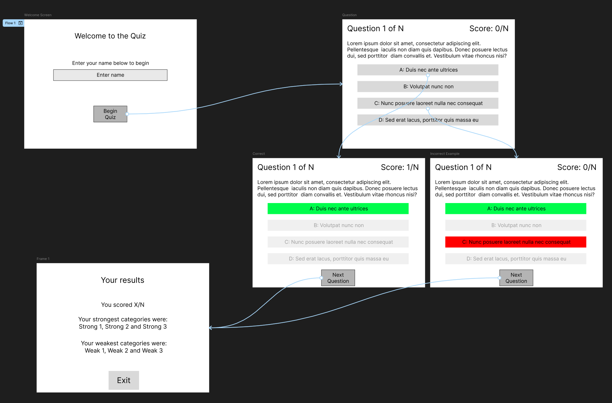
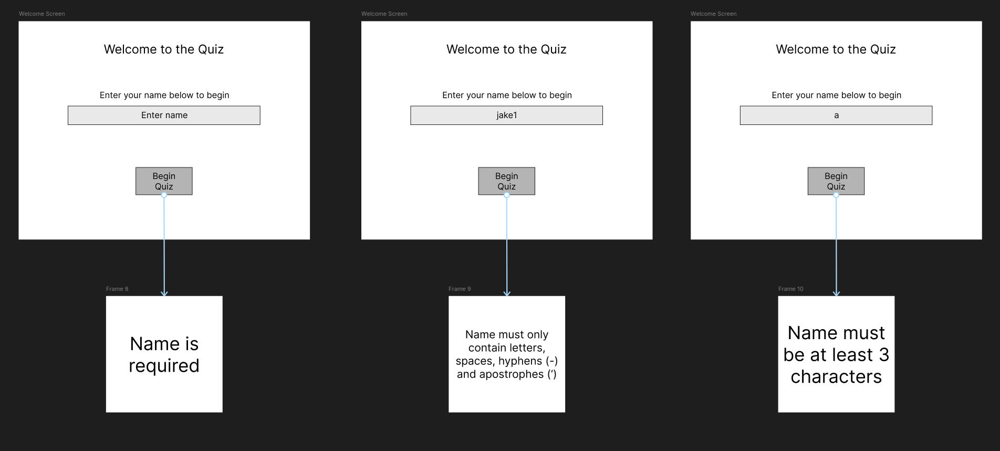

# Quiz
## Introduction
The [app name] app is a Minimum Viable Product (MVP) developed for our workplace, a company providing managed IT services. 

As part of our onboarding, the organisation requires a method of testing new support agents' knowledge to identify any gaps in existing skills to focus training in the appropriate areas. This quiz implements a category system so that upon completion of the quiz it is possible to see the strongest and weakest areas to enable said focused training.

This quiz is developed as a desktop program, utilising [Python](https://python.org) and [Tkinter](https://docs.python.org/3/library/tkinter.html). 

## Design
### GUI Designs
**Figure 1** shows the early protoype which was used during the initial design stage of the program. It represents the basic user journey from the starting screen, to a single question (as an example) to the finish screen highlighting the weak areas.

It contains some basic colour highlighting to showcase the idea clearly, however this is not intended to perfectly represent the end application.


**Figure 1**

**Figure 2** shows the journey related to planned validation requirements and error messages on the name input fields. These ensure that the user enters a valid name before proceeding to the questions


**Figure 2**
### Requirements
#### Functional requirements
| ID  | Requirement                                                                                                                  |
| --- | ---------------------------------------------------------------------------------------------------------------------------- |
| FR1 | The application must allow a user to enter their name                                                                        |
| FR2 | The name entered must be a valid name (e.g. no numbers)                                                                      |
| FR3 | The application must show a single question at a time and all possible answers                                               |
| FR4 | The application must load all questions from a persistent file and not contain any hard coded questions outside of tests     |
| FR5 | The application must save all attempts into some form of persistent storage (e.g. CSV file)                                  |
| FR5 | The application should keep track of the score per question and output a summary based on the question categories at the end |
#### Non-funcational requirements
| ID   | Requirement                                                    |
| ---- | -------------------------------------------------------------- |
| NFR1 | The application should run as a standalone desktop application |
| NFR2 | Stored data should be readable using standalone software       |
| NFR3 |                                                                |
| NFR4 |                                                                |
### Tech Stack Outline
The following software and libraries are used in the creation and operation of this program
- [Python 3](https://python.org) is the programming language used
- [Tkinter](https://docs.python.org/3/library/tkinter.html) is the GUI library used
- [unittest](https://docs.python.org/3/library/unittest.html) for automated unit testing
- [typing](https://docs.python.org/3/library/typing.html) for type hinting
- [re](https://docs.python.org/3/library/re.html) for regular expression parsing
- [datetime](https://docs.python.org/3/library/datetime.html) for date and time handling

### Code Design
Due to the nature of Tkinter as a framework, this project is heavily object-oriented. **Figure 3** shows the class diagram of the codebase. The [raw DrawIO file](docs/Class%20Diagram.drawio) is also available in the `docs/` folder.

TODO: fix tk.Tk


There is a central (or "root") class `QuizApp` which defines the main window and holds most of the state. This class inherits `tk.Tk`.

Each individual view is its own class inherting the `tk.Frame` class. This aids in splitting up the project into different classes for different functions so it becomes a lot clearer which view is resposnible for which UI elements and the flow between them.

**Figure 3**
## Development
## Testing
Both automated and manual testing was used and performed throughout the development process.

Automated tests in the form of unit testing was added early on and run upon each commit, to ensure code functions across different platforms and to ensure future changes do not break existing functionality.
The `Actions` tab contains the results of every run, and **Figure 4** shows the output of the unit testing:

**TODO Figure 4**

Manual testing was performed throughout the process to test UI interactions and flow as these are harder to test on a headless CI. This was testing that the required UI elements were visible and that the state changes via the buttons worked as intended.

A summary table of manual tests against the functional and non-functional requirements are below:


## Documentation
### User documentation
#### Running the quiz
1. Install [Python 3](https://python.org/) from the offical Python website following the [official documentation](#) for your operating system
2. Clone this repository using `git clone git@github.com:jake-uni-work/ifcs-summative-2`
3. Double click on `main.py` (or run `python main.py`) to start the quiz
#### Changing the questions
Upon starting, the Quiz will attempt to load a file named `questions.csv` to look for questions. 

If you wish to change, add, or remove questions, you can open this file in any CSV editor (e.g. Microsoft Excel)

If you wish to load a different CSV file upon starting the program, you can run `python main.py <path to question file>`
#### Viewing results after the end screen
All results are saved into a CSV file `results.csv`. This allows the results to be analysed in any CSV editor or spreadsheet software (e.g. Microsoft Excel).

There are plans to introduce a full results viewer which will allow full analysis of the results from within the program.
### Technical Documentation
In order to improve readability the project is split up into seperate files for different purposes.

- `constants.py` contains all constant data (window size, colours, etc.)
- `main.py` contains the main root `tk.Tk` application and the runner code. The Quiz is structured such that every individual "screen" is a self container `tk.Frame`.
- the `screens/` folder contains each individual screen
  - `screens/welcome.py` contains the Welcome screen, responsible for collecting the users name and validating it
  - `screens/question.py` contains the Question screen, responsible for asking an individual question, checking the answer, adjusting the score, and asking the next question
  - `screens/end.py` contains the End screen, responsible for showing the final score and what categories were the strongest and weakest. It also (currently) contains the code to calculate the scores by category although this is pending being moved
- `test/` contains the unit tests and sample question file used during the testing process
- `question_loader.py` contains the loading code to load and parse questions
- `validation.py` contains all validators for names

To run the unit tests:
```sh
python -m unittest discover test
```

## Evaluation